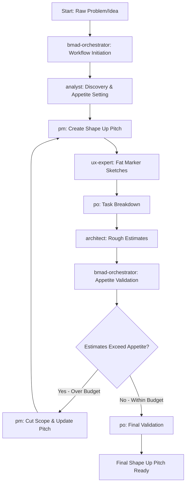

# BMad Method - Shape Up Edition

A fork of the BMad Method enhanced with Shape Up methodology for appetite-driven planning and pitch creation.

## What's New in Shape Up Edition

This fork integrates **Shape Up methodology** by Ryan Singer (Basecamp) with BMad's structured planning approach for **incremental product improvements**, enabling:

- **Appetite-First Planning** - Start with time constraints, shape solutions to fit
- **Current State Analysis** - Understand existing product before shaping improvements
- **Fat Marker Text Breadboards** - Clean text-based solution flows without over-prescription  
- **Automatic Scope Cutting** - Built-in feedback loop when estimates exceed appetite
- **Developer Autonomy** - Technical decisions left to implementation teams
- **Betting Table Ready** - Pitches formatted for Shape Up decision-making

## Key Differences from Original BMad

| Aspect | Original BMad | Shape Up Edition |
|--------|---------------|------------------|
| **Planning Approach** | Feature-complete requirements | Appetite-constrained pitches for incremental improvements |
| **Solution Detail** | Detailed specifications | Fat marker text-based breadboards |
| **Scope Management** | Fixed scope, variable time | Fixed time, variable scope with automatic cutting |
| **Developer Guidance** | Prescriptive architecture | Preserved technical autonomy |
| **Risk Management** | Risk identification | Circuit breakers + appetite protection |
| **Agent Interaction** | Standard BMad flow | Interactive elicitation with clarifying questions |
| **Current State** | Project documentation | Built-in current state analysis for incremental improvements |
| **Estimation** | Detailed estimates | Rough estimates for appetite validation |

## Shape Up Workflow

The enhanced workflow follows BMad planning patterns while implementing Shape Up methodology:



## Agent Role Distribution

### 🔍 **Analyst** - Discovery & Appetite Setting
- Handles complete discovery phase: raw idea, current state, and appetite definition
- Validates problem with user evidence through interactive questioning
- Identifies complexity risks and integration challenges
- Sets foundation for PM to create Shape Up pitch

### 📋 **PM** - Shape Up Pitch Creation (Main Artifact)
- Creates the primary Shape Up pitch artifact using template
- Builds comprehensive pitch based on analyst's discovery foundation
- Defines business scope, success criteria, and analytics framework
- Handles scope cutting when estimates exceed appetite

### 🎨 **UX Expert** - Fat Marker Sketches (Always Involved)
- Always creates text-based breadboards following Shape Up Ch.4 methodology
- **Breadboard format**: Places (underlined), affordances (listed below), connections (arrows)
- Defines places, affordances, and connections without visual design details
- Clean text format that's always valuable for understanding user flows
- Solution direction preserving developer autonomy

### ⚖️ **PO** - Task Breakdown & Final Validation
- Breaks solution into basic tasks/epics for estimation
- Coordinates with architect for rough effort estimates
- Validates final artifacts are complete and appetite-aligned
- Ensures betting table readiness

### 🏗️ **Architect** - Rough Estimation for Appetite Validation
- Provides rough estimates for PO task breakdown
- Estimates complexity and effort for appetite validation
- Identifies technical risks that could affect estimates
- Focus on effort assessment, not solution prescription
- Preserves developer autonomy while enabling realistic appetite validation

### 🎯 **Orchestrator** - Workflow Control & Appetite Discipline
- Initiates workflow and manages agent handoffs
- Validates estimates against appetite constraints
- Triggers scope cutting when estimates exceed appetite
- Ensures Shape Up methodology compliance throughout
- Controls flow rather than executing tasks (like regular BMad)

## How to Use Shape Up Edition

### Method 1: Web UI (Recommended for Planning)

**Step 1: Get the Team Bundle**
1. Copy the contents of `team/teams/team-fullstack.txt` from this repository
2. Create a new AI agent (ChatGPT, Claude, or Gemini)
3. Upload the team bundle file
4. Set instructions: "Your critical operating instructions are attached, do not break character as directed"

**Step 2: Start Shape Up Planning**
```
*workflow shape-up-planning
```

**Step 3: Follow the Guided Process**
The orchestrator will guide you through:
1. **Analyst**: Complete discovery (raw idea + current state + appetite + validation)
2. **PM**: Create Shape Up pitch (main artifact)
3. **UX Expert**: Text-based breadboards
4. **PO**: Task breakdown for estimation
5. **Architect**: Rough estimates
6. **Orchestrator**: Appetite validation and scope cutting if needed

### Method 2: IDE Integration

**Step 1: Load BMad Agents**
```
@team/agents/bmad-orchestrator.txt
```

**Step 2: Start Workflow**
```
*workflow shape-up-planning
```

### Method 3: Individual Agent Usage

You can also use individual agents for specific tasks:
```
@team/agents/analyst.txt     # For discovery and problem validation
@team/agents/pm.txt          # For creating Shape Up pitches
@team/agents/ux-expert.txt   # For fat marker breadboards
```

## What You'll Get

The workflow produces these working artifacts in `docs/working/` (not committed to git):
- `discovery-analysis.md` - Complete problem and appetite analysis
- `shape-up-pitch.md` - Main Shape Up pitch (betting table ready)
- `solution-sketches.md` - Text-based breadboards
- `task-breakdown.md` - Estimation breakdown

**Final Output**: When satisfied with the pitch, copy `docs/working/shape-up-pitch.md` to your main `docs/` folder for permanent storage.

## Example Session

**You**: "I want to improve our maintenance window communication"

**Orchestrator**: "Welcome! Handing you to our Analyst for discovery..."

**Analyst**: "Hi! I'm Mary. Let me understand your raw idea, current state, and help set appetite..."

**PM**: "Hello! I'm John. I'll create the Shape Up pitch based on Mary's discovery..."

**UX Expert**: "Hi! I'm Sally. I'll create text breadboards for the user flow..."

**PO**: "Hello! I'm Sarah. I'll break this into tasks for estimation..."

**Architect**: "Hi! I'm Winston. I'll provide rough estimates..."

**Orchestrator**: "Estimates fit appetite! Creating final pitch..." OR "Over budget - returning to PM for scope cutting..."

## Quick Start

### Using the Shape Up Workflow

```bash
*workflow shape-up-planning
```

This will guide you through creating appetite-disciplined pitches using existing BMad agents in Shape Up mode.

### Example Output Format

The workflow produces pitches in this format:

```markdown
# Problem
[Raw problem with user evidence and business impact]

## Business point of view
[Business context and stakeholder impact]

**Appetite:** [Time investment willing to make]

---

# Solution

## Goals
[Clear business outcomes and success criteria]

## Details
[Fat marker sketches with places, affordances, connections]

### No-Gos (Scope Boundaries)
[What we're explicitly NOT doing]

---

# Analytics - Leading & Lagging Indicators
[Measurement strategy and success metrics]
```

## Shape Up Methodology Compliance

This fork follows Shape Up principles while preserving BMad patterns:

- ✅ **Appetite drives scope** (not the reverse)
- ✅ **Incremental improvement focus** (designed for existing products, not 0-to-1)
- ✅ **Current state analysis** (understand what you're building on)
- ✅ **PM creates main artifacts** (like regular BMad planning workflow)
- ✅ **Analyst does complete discovery** (sets foundation for PM)
- ✅ **Text-based breadboards** (clean, readable fat marker sketches)
- ✅ **UX Expert always involved** (breadboards valuable for all user flows)
- ✅ **Automatic scope cutting** when estimates exceed appetite
- ✅ **Developer autonomy** maintained in technical decisions
- ✅ **Orchestrator controls flow** (doesn't execute tasks)
- ✅ **Betting table ready** format for decision-making

## Installation & Usage

Same as original BMad - this fork maintains full compatibility with existing BMad workflows while adding Shape Up capabilities.

### Shape Up Specific Files

- `.bmad-core/workflows/shape-up-planning.yaml` - Main Shape Up workflow following BMad patterns
- `.bmad-core/templates/shape-up-final-pitch-tmpl.yaml` - Final pitch template matching user format
- `.bmad-core/templates/shape-up-pitch-tmpl.yaml` - Alternative Shape Up pitch template
- `.bmad-core/tasks/create-shape-up-pitch.md` - Shape Up pitch creation task
- `.bmad-core/checklists/shape-up-pitch-checklist.md` - Methodology validation checklist

## Contributing

This fork maintains the BMad Method's open approach while adding Shape Up methodology integration. Contributions that enhance appetite-driven planning and developer autonomy are welcome.

## License

Same as original BMad Method.

## References

- [Shape Up: Stop Running in Circles and Ship Work that Matters](https://basecamp.com/shapeup) by Ryan Singer
- [Original BMad Method](https://github.com/bmad-method/bmad-method) 

---

**Built with BMad™ Core + Shape Up Methodology**
