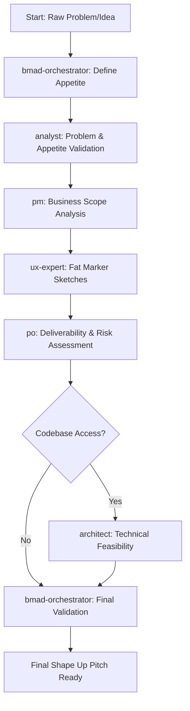

# BMad Method - Shape Up Edition

A fork of the BMad Method enhanced with Shape Up methodology for appetite-driven planning and pitch creation.

## What's New in Shape Up Edition

This fork integrates **Shape Up methodology** by Ryan Singer (Basecamp) with BMad's structured planning approach, enabling:

- **Appetite-First Planning** - Start with time constraints, shape solutions to fit
- **Fat Marker Sketches** - Solution direction without over-prescription  
- **Circuit Breakers** - Built-in stopping triggers to protect appetite
- **Developer Autonomy** - Technical decisions left to implementation teams
- **Betting Table Ready** - Pitches formatted for Shape Up decision-making

## Key Differences from Original BMad

| Aspect | Original BMad | Shape Up Edition |
|--------|---------------|------------------|
| **Planning Approach** | Feature-complete requirements | Appetite-constrained pitches |
| **Solution Detail** | Detailed specifications | Fat marker sketches |
| **Scope Management** | Fixed scope, variable time | Fixed time, variable scope |
| **Developer Guidance** | Prescriptive architecture | Preserved technical autonomy |
| **Risk Management** | Risk identification | Circuit breakers + appetite protection |

## Shape Up Workflow

The enhanced workflow follows Shape Up principles with proper role distribution:



## Agent Role Distribution

### 🔍 **Analyst** - Problem & Appetite Validation
- Validates raw problem with user evidence
- Validates appetite against problem significance
- Identifies rabbit holes and complexity traps
- Defines circuit breakers and stopping triggers

### 📋 **PM** - Business Perspective & Scope  
- Business impact and stakeholder analysis
- Scope boundaries and "no-gos" definition
- Success metrics and business outcomes
- Analytics and measurement planning

### 🎨 **UX Expert** - Fat Marker Sketches & Solution Direction
- Fat marker sketches using breadboarding technique
- Defines places, affordances, and connections
- High-level user flows without visual details
- Solution direction preserving developer autonomy

### ⚖️ **PO** - Deliverability & Risk Management
- Appetite vs scope alignment validation
- Deliverability assessment within timeframe
- Circuit breaker validation and risk mitigation
- Betting table preparation

### 🏗️ **Architect** - Technical Feasibility (Optional)
- Technical feasibility within appetite constraints
- Integration complexity assessment (when codebase access available)
- Technical risk identification without over-prescription

### 🎯 **Orchestrator** - Workflow Coordination
- Ensures Shape Up methodology compliance
- Manages agent handoffs and workflow
- Final validation and pitch preparation

## Quick Start

### Using the Shape Up Workflow

```bash
*workflow shape-up-planning
```

This will guide you through creating appetite-disciplined pitches using existing BMad agents in Shape Up mode.

### Example Output Format

The workflow produces pitches in this format:

```markdown
# Problem
[Raw problem with user evidence and business impact]

## Business point of view
[Business context and stakeholder impact]

**Appetite:** [Time investment willing to make]

---

# Solution

## Goals
[Clear business outcomes and success criteria]

## Details
[Fat marker sketches with places, affordances, connections]

### No-Gos (Scope Boundaries)
[What we're explicitly NOT doing]

---

# Analytics - Leading & Lagging Indicators
[Measurement strategy and success metrics]
```

## Shape Up Methodology Compliance

This fork follows Shape Up principles exactly:

- ✅ **Appetite drives scope** (not the reverse)
- ✅ **Fat marker sketches** preserve implementation flexibility
- ✅ **Circuit breakers** protect against scope creep
- ✅ **Developer autonomy** maintained in technical decisions
- ✅ **Betting table ready** format for decision-making

## Installation & Usage

Same as original BMad - this fork maintains full compatibility with existing BMad workflows while adding Shape Up capabilities.

### Shape Up Specific Files

- `.bmad-core/workflows/shape-up-planning.yaml` - Main Shape Up workflow
- `.bmad-core/templates/shape-up-final-pitch-tmpl.yaml` - Final pitch template
- `.bmad-core/tasks/create-shape-up-pitch.md` - Shape Up pitch creation task
- `.bmad-core/checklists/shape-up-pitch-checklist.md` - Methodology validation

## Contributing

This fork maintains the BMad Method's open approach while adding Shape Up methodology integration. Contributions that enhance appetite-driven planning and developer autonomy are welcome.

## License

Same as original BMad Method.

## References

- [Shape Up: Stop Running in Circles and Ship Work that Matters](https://basecamp.com/shapeup) by Ryan Singer
- [Original BMad Method](https://github.com/bmad-method/bmad-method) 

---

**Built with BMad™ Core + Shape Up Methodology**
