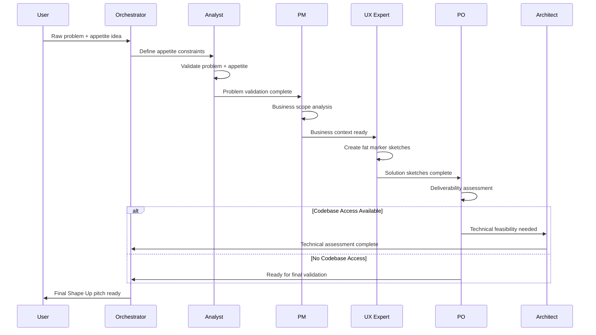

# Shape Up Integration Guide

This document explains how Shape Up methodology is integrated into BMad Method and how to use the enhanced workflow.

## Shape Up Methodology Overview

Shape Up is a product development methodology created by Ryan Singer at Basecamp. It focuses on:

- **Appetite-driven planning** - Start with time constraints, shape solutions to fit
- **Fat marker sketches** - High-level solution direction without over-specification
- **Circuit breakers** - Built-in stopping mechanisms to prevent runaway projects
- **Developer autonomy** - Technical decisions left to implementation teams

## Integration with BMad Method

### Core Principles Integration

| Shape Up Principle | BMad Integration | Implementation |
|-------------------|------------------|----------------|
| **Appetite First** | Orchestrator starts with appetite definition | `*workflow shape-up-planning` begins with appetite constraints |
| **Problem Shaping** | Analyst validates problem against appetite | Advanced elicitation for rabbit hole identification |
| **Fat Marker Sketches** | UX Expert creates breadboarding sketches | Places, affordances, connections without visual details |
| **Circuit Breakers** | PO validates stopping triggers | Appetite protection and deliverability assessment |
| **Developer Autonomy** | Architect provides guidance not prescription | Technical feasibility without implementation constraints |

### Workflow Sequence



## Agent Roles in Shape Up Mode

### 🔍 Analyst - Problem & Appetite Validation

**Shape Up Focus:**
- Validate raw problem with user evidence
- Validate appetite against problem significance
- Identify rabbit holes that could break appetite
- Define circuit breakers and stopping triggers

**Key Outputs:**
- Problem validation with evidence
- Appetite justification analysis
- Rabbit hole identification
- Circuit breaker definitions

**Example Questions Asked:**
- "Is this problem worth 6 weeks of investment?"
- "What evidence do we have that users experience this pain?"
- "What complexity could cause us to exceed our appetite?"
- "At what point should we stop and reassess?"

### 📋 PM - Business Perspective & Scope

**Shape Up Focus:**
- Business impact and stakeholder analysis
- Scope boundaries and "no-gos" definition
- Success metrics and business outcomes
- Stakeholder communication planning

**Key Outputs:**
- Business context and stakeholder impact
- Clear scope boundaries and "no-gos"
- Success metrics and measurement plan
- Analytics framework (leading/lagging indicators)

**Example Deliverables:**
- Business impact analysis
- Stakeholder communication plan
- Success criteria definition
- Measurement and analytics strategy

### 🎨 UX Expert - Fat Marker Sketches & Solution Direction

**Shape Up Focus:**
- Fat marker sketches using breadboarding technique
- Define places, affordances, and connections
- High-level user flows without visual details
- Solution direction preserving developer autonomy

**Key Outputs:**
- Breadboard sketches (places, affordances, connections)
- High-level user flows
- Solution direction without implementation details
- User experience framework

**Breadboarding Elements:**
- **Places**: Screens, dialogs, views users navigate to
- **Affordances**: Buttons, fields, actions users can take
- **Connection Lines**: How affordances connect places

### ⚖️ PO - Deliverability & Risk Management

**Shape Up Focus:**
- Appetite vs scope alignment validation
- Deliverability assessment within timeframe
- Circuit breaker validation and risk mitigation
- Betting table preparation

**Key Outputs:**
- Deliverability assessment
- Risk mitigation plan
- Circuit breaker validation
- Betting table readiness report

**Validation Checks:**
- Does scope fit appetite?
- Are circuit breakers realistic?
- Can this be delivered by a development team?
- Is this ready for betting table consideration?

### 🏗️ Architect - Technical Feasibility (Optional)

**Shape Up Focus:**
- Technical feasibility within appetite constraints
- Integration complexity assessment
- Technical risk identification without over-prescription
- Architecture guidance preserving implementation flexibility

**Key Outputs:**
- Technical feasibility assessment
- Integration complexity analysis
- Technical risk identification
- Architecture guidance (not prescription)

**When Available:**
- Only when codebase access is available
- Provides guidance without constraining implementation
- Identifies technical risks within appetite
- Preserves developer decision-making autonomy

### 🎯 Orchestrator - Workflow Coordination

**Shape Up Focus:**
- Ensures Shape Up methodology compliance
- Manages agent handoffs and workflow
- Final validation and pitch preparation
- Converts to betting table format

**Key Outputs:**
- Shape Up methodology compliance validation
- Final pitch in betting table format
- Workflow coordination and handoffs
- Quality assurance of Shape Up principles

## Output Format

The Shape Up workflow produces pitches in this exact format:

```markdown
# Problem
[Raw problem with user evidence and business impact]

## Business point of view
[Business context and stakeholder impact]

**Appetite:** [Time investment willing to make]

---

# Solution

## Goals
[Clear business outcomes and success criteria]

## Details
[Fat marker sketches with places, affordances, connections]

### No-Gos (Scope Boundaries)
[What we're explicitly NOT doing]

---

# Analytics - Leading & Lagging Indicators

### Lagging indicator(s) - Why?
[Business impact measurements]

### Hypothesis & evaluation - How?
[Measurement methods and validation]

### Leading indicator(s) - What?
[Early success signals]

### Preliminary targets
[Success metric targets]
```

## Usage Examples

### Starting a Shape Up Planning Session

```bash
# Activate Shape Up workflow
*workflow shape-up-planning

# Orchestrator will guide you through:
# 1. Appetite definition
# 2. Problem validation
# 3. Business scope analysis  
# 4. Fat marker sketching
# 5. Deliverability assessment
# 6. Technical feasibility (if codebase access)
# 7. Final pitch preparation
```

### Example Session Flow

1. **User**: "I want to improve maintenance window communication"
2. **Orchestrator**: "What's your appetite for this problem?"
3. **User**: "3 weeks, 1 person"
4. **Analyst**: Validates problem significance against 3-week appetite
5. **PM**: Analyzes business impact and stakeholder needs
6. **UX Expert**: Creates fat marker sketches of communication flow
7. **PO**: Validates deliverability within 3-week constraint
8. **Orchestrator**: Produces final betting table ready pitch

### Comparing Traditional BMad vs Shape Up Mode

| Aspect | Traditional BMad | Shape Up Mode |
|--------|------------------|---------------|
| **Starting Point** | Feature requirements | Appetite + problem |
| **Solution Detail** | Detailed specifications | Fat marker sketches |
| **Risk Management** | Risk identification | Circuit breakers |
| **Scope Approach** | Fixed scope, estimate time | Fixed time, flexible scope |
| **Developer Guidance** | Technical architecture | Preserved autonomy |
| **Output Format** | PRD + Architecture | Betting table pitch |

## Best Practices

### When to Use Shape Up Mode

✅ **Good for:**
- New feature exploration with unclear scope
- Problems with significant business impact
- When you want to preserve developer creativity
- Betting table decision-making
- Appetite-constrained planning

❌ **Not ideal for:**
- Bug fixes or maintenance tasks
- Features with fixed technical requirements
- Compliance or regulatory implementations
- When detailed specifications are required

### Tips for Success

1. **Start with Appetite**: Always define time constraints before solution exploration
2. **Embrace Fat Markers**: Resist the urge to add detailed specifications
3. **Trust Circuit Breakers**: Use stopping triggers to protect appetite
4. **Preserve Autonomy**: Let developers make technical decisions
5. **Focus on Outcomes**: Define what success looks like, not how to achieve it

## Troubleshooting

### Common Issues

**Problem**: "The solution sketch feels too vague"
**Solution**: Remember Shape Up principle - provide direction, not prescription. Developers need room for creativity.

**Problem**: "Appetite seems too small for the problem"
**Solution**: Either increase appetite or reduce scope. Shape Up is about fitting solutions to appetite, not the reverse.

**Problem**: "Circuit breakers feel arbitrary"
**Solution**: Base them on complexity analysis and appetite protection. They should be realistic stopping points.

**Problem**: "Business stakeholders want more detail"
**Solution**: Focus on outcomes and success criteria. Shape Up pitches show what, not how.

## References

- [Shape Up: Stop Running in Circles and Ship Work that Matters](https://basecamp.com/shapeup) by Ryan Singer
- [Shape Up Chapter 4: Find the Elements](https://basecamp.com/shapeup/1.3-chapter-04) - Breadboarding technique
- [Shape Up Chapter 6: Write the Pitch](https://basecamp.com/shapeup/1.5-chapter-06) - Pitch format
- [BMad Method Documentation](https://github.com/bmad-method/bmad-method)

---

*This integration preserves all BMad Method capabilities while adding Shape Up methodology for appetite-driven planning.*
